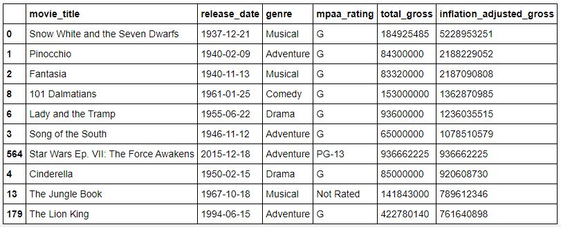
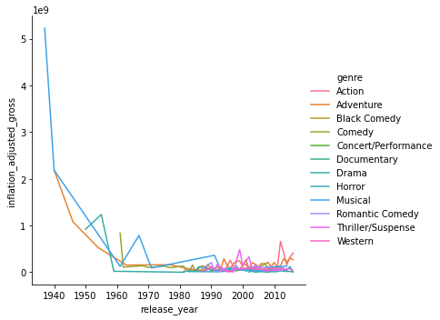

Walt Disney Studios is the foundation on which The Walt Disney Company was built. The Studios has produced more than 600 films since their debut film, Snow White and the Seven Dwarfs in 1937. While many of its films were big hits, some of them were not. In this notebook, we will explore a dataset of Disney movies and analyze what contributes to the success of Disney movies.

The data contains 579 Disney movies with six features: movie title, release date, genre, MPAA rating, total gross, and inflation-adjusted gross.

**The top 10 Disney movies that have earned the most at the box office:**

**Genre Popularity Trend:**

For Disney movies, Action and Adventure genres are growing the fastest. 

**Should Disney studios make more action and adventure movies?**

We will build a linear regression model to understand the relationship between genre and box office gross.
